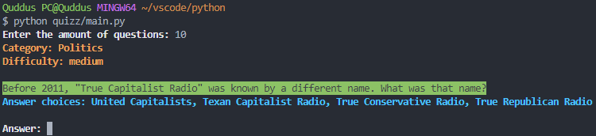

# Python Quiz Game

## Overview

This is just a small program that I wrote in Python to serve questions fetched from opentdb.com's API endpoint. Image above is the preview for it, and how to run it from your favorite terminal.

NOTE: Some terminal doesn't support text coloring!

## License

This program is released under [MIT License](LICENSE.txt).

The questions in opentdb.com are released under [CC BY-SA 4.0](https://creativecommons.org/licenses/by-sa/4.0/).
